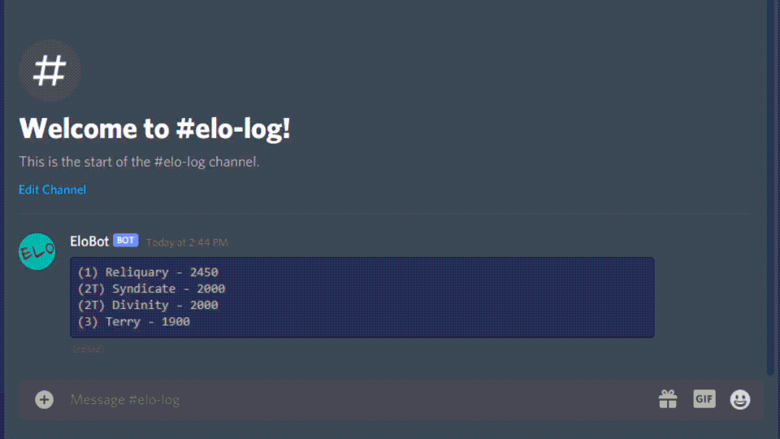

# Elobot

Elobot is a Discord bot that maintains a leaderboard of teams, as well as calculates elo rankings for standings within the leaderboard. Elo calculations are the same formula as documented within the Mordhau Fight Club (MFC) Discord. MFC is the competitive gaming scene for the game Mordhau.

The bot has some assumptions of how your Discord server is setup already. You must use roles for team names. You can edit a team after its already been created without mentioning roles by just typing in the name of the role, and if it has a space make sure to put quotes around the team name. For exmaple, `!setelo "Apeman A" 1500` is the same as using a role mention like so `!setelo @Apeman A 1500`. 

The bot works off creating json files for each guild, the files are minimal in size and just track the leaderboard/settings. This is so data is retained if the bot has to restart.

## Commands

`!elobothelp` - Displays the help page for the bot and this command list.

`!showroles` - Print a nice embed message listing the allowed roles. Administrator and allowed roles can run this command.

`!addroles roleMention` - Adds a role to the allowed roles list to give permission to run bot commands. Only users with administrative priveledges in Discord can add an allowed role. Does not include the !simulmatch command.

`!addteam roleMention int` - Adds role/team with specified elo. 

`!setelo roleMention int` - Manually set elo of a role/team. Where int is an whole integer.

`!showhistory roleMention` - Displays the last 10 records of a team and their score if they played against another team.

`!removeteam roleMention` - Deletes a team from the leaderboard and log.

`!setboardchannel channelMention` - Sets the channel to use for the leaderboard. Must be a channel mention.

`!refreshboard` - Refreshes the board if there are any pending changes. This shouldn't be needed. I used it for debugging when I needed to update a team from its json file.

`!addmatch roleMention Score-Score roleMention` - Adds a match between two teams with the maximum amount of wins being 3. It will update the elo in the leaderboard automatically and display an embedded message after sending the command displaying the elo change.

`!simulmatch roleMention Score-Score roleMention` - Same thing as !addmatch except it won't update the leaderboard or log. Just to see the elo change on possible outcomes.

