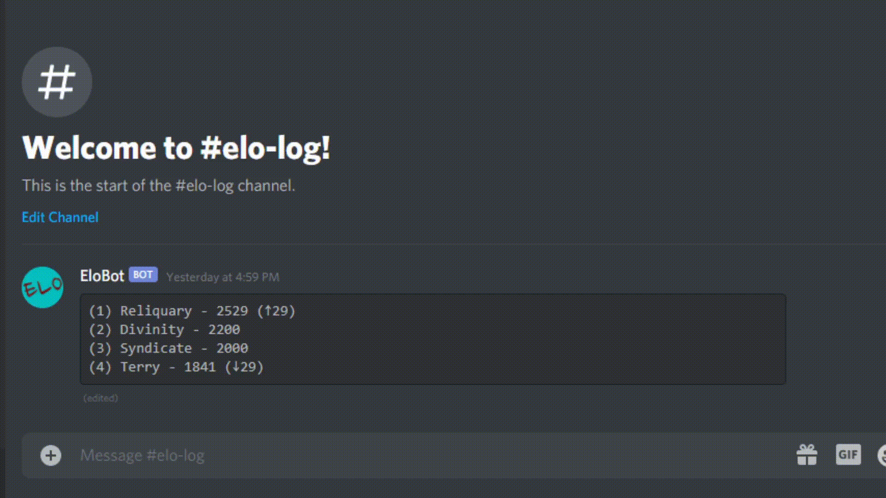

# Elobot

Elobot is a Discord bot that maintains a leaderboard of teams, as well as calculates elo rankings for standings within the leaderboard. Elo calculations are the same formula as documented within the Mordhau Fight Club (MFC) Discord. MFC is the competitive gaming scene for the game Mordhau.

