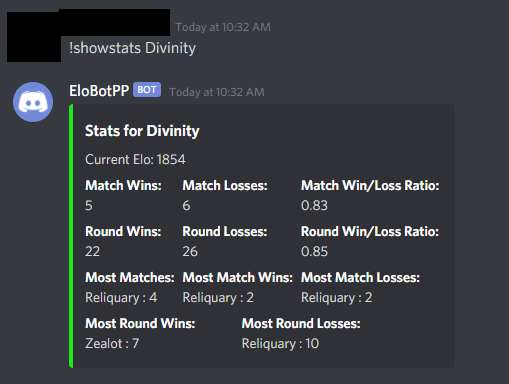

# Elobot

Elobot is a Discord bot that maintains a leaderboard of teams, as well as calculates elo rankings for standings within the leaderboard. Elo calculations are the same formula as documented within the Mordhau Fight Club (MFC) Discord. MFC is the competitive gaming scene for the game Mordhau.

The bot has some assumptions of how your Discord server is setup already. You must use roles for team names. You can use a team after its already been created without mentioning the role by typing in the name of the role, and if it has a space make sure to put quotes around the team name. For exmaple, `!setelo "Apeman A" 1500` is the same as using a role mention like so `!setelo @Apeman A 1500`. 

The bot works off creating json files for each guild, the files are minimal in size and just track the leaderboard/settings. This is so data is retained if the bot has to restart.

## Commands

`!elobothelp` - Displays the help page for the bot and this command list.

`!showsettings` - Prints an embed message listing the allowed roles as well as if the leaderboard is set to be hidden. Administrator and allowed roles can run this command.

`!addroles roleMention` - Adds a role to the allowed roles list to give permission to run bot commands. Only users with administrative priveledges in Discord can add an allowed role. Does not include the !simulmatch command.

`!addteam roleMention int` - Adds role/team with specified elo. 

`!setelo roleMention int` - Manually set elo of a role/team. Where int is an whole integer.

`!showhistory roleMention` - Displays the last 10 records of a team and their score if they played against another team.

`!showstats roleMention` - Displays some stats like matches won, lost, rounds win/loss, along with their ratios. Also find the most played opponents, most won/lost against opponents.

`!removeteam roleMention` - Deletes a team from the leaderboard and log.

`!setboardchannel channelMention` - Sets the channel to use for the leaderboard. Must be a channel mention.

`!refreshboard` - Refreshes the board if there are any pending changes. This shouldn't be needed. I used it for debugging when I needed to update a team from its json file.

`!addmatch roleMention Score-Score roleMention` - Adds a match between two teams with the maximum amount of wins being 3. It will update the elo in the leaderboard automatically and display an embedded message after sending the command displaying the elo change.

`!simulmatch roleMention Score-Score roleMention` - Same thing as !addmatch except it won't update the leaderboard or log. Just to see the elo change on possible outcomes.

`!showlog` - Shows the last 10 adminitrative actions, who took them, and what day.

`!hideboard true/false` - This allows the administrator to hide the auto-updating leaderboard if they don't want it.

`!board` - Sends a copy of the leaderboard to the channel called from. This is useful if you are hiding the leaderboard with the above command.

## Setup

### Easy mode:

Invite the bot to your server: [__Discord Bot Invite Link__](https://discord.com/api/oauth2/authorize?client_id=762718542562066494&permissions=68608&scope=bot)

### Manual setup

Made with Python 3.9.0, but should also work with 3.7 or in between those two versions.
1. Install the required libraries for the bot. 

    `pip install python-dotenv` - Used to store your Discord bot token. 

    `pip install discord.py` - The Discord framework for Python.

2. Create a Discord app bot with permissions of "View channels", "Send Messages", and "Read Message History" (6808).
3. Copy the token from the bot you've just created and create a file in the same directory as `elobot.py` named ".env".
4. Inside the .env file, enter the following, but replace the DISCORD_TOKEN value with the Discord token from your bot:
```
# .env
DISCORD_TOKEN=NzcxNXXXXXXXXXXXXXXXXXXXXXXXXXXXXXXXXXXXX
```
5. Run the bot. `python elobot.py` - The bot will run on both Windows and Linux. Make sure both `elobot.py` an `guildconfig.py` are in the same folder together. I have the bot running as a systemd service, but you could also setup a scheduled task on Windows, or use NSSM.

If you need additional help creating a bot through Discord's developer portal, follow this tutorial: https://discordpy.readthedocs.io/en/latest/discord.html

### Getting Started

1. Add an allowed role with `!allowedrole roleMention`. You must be in this role to run commands that touch the leaderboard. If you are not in an allowed role you can't do much.
Example: `!addrole @Organizer`

2. Add teams with their starting elo. `!addteam roleMention elo`
Example: `!addteam @Reliquary 2400`

3. Add matches! `!addmatch team Score-Score team`
Example: `!addmatch @Reliquary 3-0 @Divinity` or `!addmatch Reliquary 3-0 Divinity`

4. Enable the auto updating leaderboard (disabled by default). `!hideboard true/false`
Example: `!hideboard false`
Note: If you want the leaderboard to stay hidden, you can view the leaderboard still with the command `!board`.

5. See the stats of a team. `!showstats roleMention`
Example: `!showstats @Reliquary` or `!showstats Reliquary` or `!showstats "Apemen A"`

You can also see the command log with `!showlog` to see what was ran and when. View the match history of a team with `!showhistory roleMention`. If a team disbands or needs to be removed, make sure to use `!removeteam roleMention` to remove them. Lastly, you can simulate elo results without them changing the leaderboard with the command `!simulmatch team Score-Score team`, like `!simulmatch Reliquary 3-0 Divinity`.


## Command examples

#### !showstats


#### !showhistory


#### !addmatch & !board

